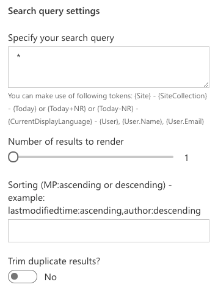
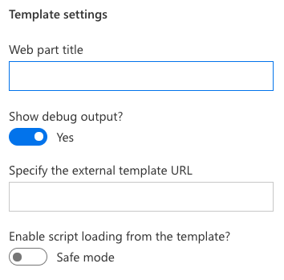

# Search Result Visualizer web part created with React and Handlebars templates

This web part is created to allow you to visualize search results by using custom Handlebars templates. Originally this web part made use of a React template system, but by switching the system to use Handlebars instead it became a lot easier to create custom templates.

> If you are interested in the original project, feel free to explore the code over here: [Search WP SPFx](https://github.com/estruyf/Search-WP-SPFx).

The idea of this web part is to mimic the functionality of the `Content Search Web Part` and its `display templates` approach.

!(Search visualizer result)[./assets/wp-example.gif]

## Minimal Path to Awesome

- Clone this repository
- In your command prompt, run:
    - `npm install`
    - `gulp serve --nobrowser`
    - Open your hosted workbench and start exploring the web part

## Using the web part

### Search query settings



#### Queries

In the query field, you can enter your own queries like:
- `*`: to retrieve everything
- `fileextension:docx`

But you can also use search tokens like:
- `{Site}`
- `{SiteCollection}`
- `{Today}` or `{Today+Number}` or `{Today-Number}`
- `{CurrentDisplayLanguage}`
- `{User}`
- `{User.Name}`
- `{User.Email}`

#### Number of results

Specify the number of results you want to retrieve for the specified query.

#### Sorting

Specify the managed property name and the sorting order (comma separated):
- Single: `lastmodifiedtime:ascending`
- Multiple: `lastmodifiedtime:ascending,author:descending`


### Template settings

By default the web part shows the debug view of your query. This returns all the fields, values, and bindings of how to make use of it in your templates.



#### Web part title

This is a title which you can specify to be used in your custom template. The Handlebar binding to be used is `{{wpTitle}}`.

#### Show debug output

This setting is by default enabled. If you want to make use of your own template you have to disable it and specify a template URL.

#### External template URL

Specify an absolute URL to your HTML template file. In the templates folder you can find a sample template file: [test.html](./templates/test.html).

> The project also automatically includes the [handlebars-helpers](https://github.com/helpers/handlebars-helpers) library for you. This way you can achieve more in your templates.

##### SharePoint Helpers

There are a couple of custom SharePoint helpers available for you to make use of. The list of available SP helpers are:
- `splitDisplayNames`: (input => "user1;user2;user3") (common example is the author field)
- `splitSPUser`: (input => "email | displayname | .... i:0#.f|membership|username") (common example is the editor field)

They can be use in the template as follows:
```html
{{splitDisplayNames Author}}
{{splitSPUser EditorOWSUSER 'displayName'}}
```

#### Script loading

With this setting you can specify if you want to execute/load the script that are defined in your template. When you add a custom template, the web part will automatically check and warn you (only when you are configuring the web part).

[Script loading warning](script-loading.png)

> By default this setting is disabled.
